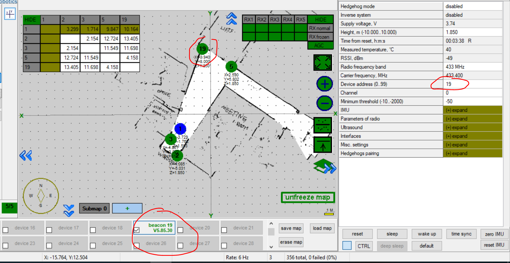
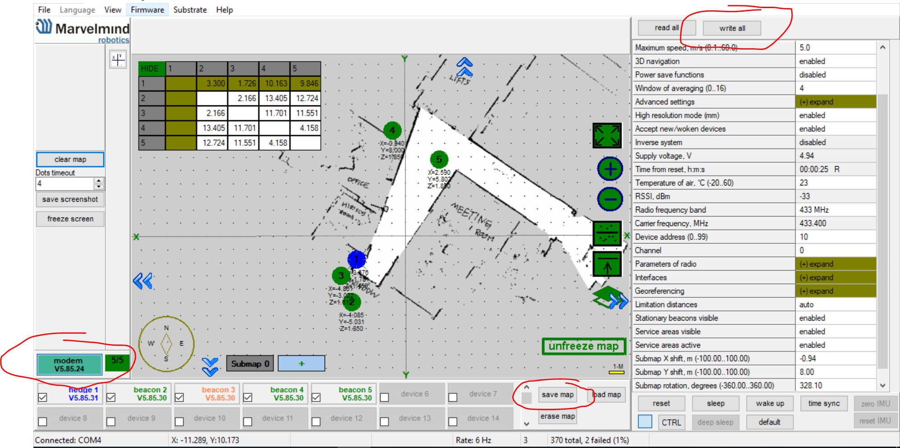

## Marvelmind Indoor GPS Usage Documentation

Author: github.com/methylDragon    
A tutorial for setting up the Marvelmind Indoor GPS Beacons!

https://www.youtube.com/watch?v=IyXB3UXHdeQ&feature=youtu.be

---

## Pre-Requisites

### Good to know

- ROS + Catkin (to understand the Interface notes)
- Linux Terminal

## Table Of Contents <a name="top"></a>

1. [Introduction](#1)  
2. [Setting Up The System](#2)    
   2.1   [Hardware Setup](#2.1)    
   2.2   [Software Setup](#2.2)    
   2.3   [Activating the System for the First Time](#2.3)    
   2.4   [Placing the Beacons](#2.4)    
   2.5   [Map Confidence](#2.5)    
   2.6   [Running the System](#2.6)    
3. [Using the System](#3)    
   3.1   [Python Interface](#3.1)    
   3.2   [Arduino Interface](#3.2)    
   3.3   [ROS Interface](#3.3)    
4. [Resources](#4)    

## 1. Introduction <a name="1"></a>

> The Marvelmind Indoor Navigation System provides high-precision (± 2 cm) indoor coordinates for autonomous robots and systems (“indoor GPS”). 

It achieves this through ultrasonic beacons that can communicate with each other! You set one beacon as the **mobile beacon (endearingly called the Hedgehog)** and put this on the robot. Use the single beacon with the IMU as the Hedgehog.

The beacons then communicate with the **router** that is **connected to your robot/computer** (do -not- connect the beacons!), which processes the data and pushes it either to the **Windows GUI** and/or **ROS messages!**


## 2. Setting Up The System <a name="2"></a>

### 2.1 Hardware Setup <a name="2.1"></a>

[go to top](#top)

We got our stuff! Now we need to prep the hardware!

1. Make sure you **charge all of the beacons and the modem via USB** before you begin! (Takes about 1-2 hours to charge)

   > LED 1 will light up and turn RED when a device is charging

2. **Turn ON the beacons**, by toggling the switch corresponding to **POWER** (ignore DFU, it's for manual programming which we should never need to do)

   > Turn off the beacons if you don't intend to use them for more than a week

>  **Note:**
>
> If this is the first time you are setting up the system, **press RESET (but do not hold) for each beacon**. LED 2 should blink.


### 2.2 Software Setup <a name="2.2"></a>

[go to top](#top)

Ok! Now we're set on hardware, let's settle the software! **You need BOTH Linux and Windows to make this work properly.** Follow these steps in order!


**On Windows**

Get your software here: https://marvelmind.com/download/

1. **Install** the **STM Driver** on **WINDOWS**

   >  You need it to interface with the beacons!

2. **Download and install** **Dashboard** on **WINDOWS**

   > This graphic user interface lets you connect the beacons and visualise the beacon data!

3. Download and update **every beacon and the modem's** firmware to the latest stable version via the **Dashboard** software (make sure every firmware file comes from the **same pack**)

   >  Do this by running **Dashboard** -> Firmware, then select the right program **(while a beacon or modem is connected!)** Make sure you select the correct file for the correct component!

   > If you're using the set we got for **SOAR**, most likely it will be hw49, 433MHz. But if you're unsure, **check the bottom of the beacon or modem for the label!**

   > If you have an issue with this due to having a firmware version which is too old, check the manual for DFU programming. It's a bit more troublesome.


**On Linux**

Not much needs to be done on Linux, since you can't run Dashboard on there. But if you want to use ROS, you need to enable the UART interface that'll let you connect to the modem and communicate with it! **UART is NOT accessible by default! You have to enable it!**

1. **Enable UART**

   > This can be done by either running:
   >
   > `$sudo chmod 0777 /dev/ttyAMA0` (which basically sets blanket permissions for anyone to access it)
   >
   > ​
   >
   > Or following this more elegant method: https://raspberrypi.stackexchange.com/questions/48211/set-permission-for-dev-ttyama0-on-boot (Only tested on RPi though. Your mileage may vary.)

2. **Ensure UART speed is set to 9600bit/s** on Dashboard on Windows

3. **PREPARE FOR ROS** (later)


### 2.3 Activating the System for the First Time <a name="2.3"></a>

[go to top](#top)

1. Connect each beacon and modem, and click the **DEFAULT** button on the Dashboard to upload the default settings. **For the Hedgehog,** locate the Hedgehog mode setting, and **enable it!**

   >  You can also use this opportunity to manually set the component's address if you wish!
   >
   >  https://www.youtube.com/watch?v=vm-nCAJrmVU&feature=youtu.be
   >
   >  Remember to press "write all"
   >
   >  
   >
   >  


2. Then press (but not hold!) the hardware **RESET** button to let the components reflect the change (it's a soft reset)

3. Great! Now it's time to test! **Place your beacons**, and **connect the modem to the Windows PC with Dashboard open.**

4. The components should show as connected. Now **wake them up** by **clicking on their buttons** in the Dashboard panel! Components go to sleep after 1 minute of not being connected wirelessly to the modem.

   > **You might hear some clicking at this point when the modem is connected and you have Dashboard open.** That's a good sign! Those are the ultrasound pulses!
   >
   > ​
   >
   > The components will be doing a frequency search (make sure their radio settings are all the same)
   >
   > ​
   >
   > You can change a component's settings wirelessly via the modem! It's great but slow though, **make sure you give them time to update!**

5. Wait for the beacons to **form a map**. You should be able to see them form the map and increase the accuracy of their positions on the **Dashboard**!

   > Check the top left boxes. The values should be white for all beacons except for the Hedgehog.

6.  **Freeze the map** by clicking on the button! You should hear the clicking increase in speed at this point!

   > **If you ever move the stationary beacons' positions, be sure to unfreeze the map** and let them recalibrate!

7. **It's highly recommended** for you to save the map somewhere as well, as well as write the map to the modem by selecting the modem and pressing "Write All" as well! Then, disconnect the modem, connect it again, and make sure it remembers the map!
       
   

**Now you can have some fun moving the Hedgehog around and seeing how it reflects on the map! Remember you can rotate and flip the map with the buttons and the compass!**


### 2.4 Placing the Beacons <a name="2.4"></a>

[go to top](#top)

Each sensor on each beacon has a 90 degree cone of coverage. The beacons will have to communicate with the modem via antenna, and so have to be within 100m of the modem, and preferably **have line-of-sight of at least 2 other beacons.**

**Recommended max distance between beacons:** 20m

It's best to place the beacons on the walls and ceilings, with the ultrasound sensors facing downwards for the most coverage. Basically, point all sensors to where the robot's beacon sensors will be.

For the robot's beacon, it is **VERY IMPORTANT** to ensure that the sensors are not covered in any way!

>  Also, as the pulses ARE in ultrasound, try to place the beacons on something **soft** or **non-sound conducting**.


### 2.5 Map Confidence <a name="2.5"></a>

[go to top](#top)

When the Hedgehog icon is:

**Blue** - Confident tracking

**Orange **- Confidence is lowered

**Colourless **- Packet loss or no coverage


### 2.6 Running the System <a name="2.6"></a>

[go to top](#top)

You've gone through the Activating the System section. You should know how this goes by now.

Just go from Step 3!


### 2.7 Other Features! <a name="2.7"></a>

[go to top](#top)

There's a lot more things you can do with the **Dashboard**. But you should check the manual for more info:

- Submaps (for big implementations)
- Paired Hedgehogs (use two Hedgehogs simultaneously to determine direction facing)
- Loading and saving maps (of course)
- User payload streaming
- IMU


## 3. Using the System <a name="3"></a>

[go to top](#top)

Info from: https://marvelmind.com/download/

So we've settled the Window GUI interface via Dashboard. What if you wanted to... say, use Linux or an Arduino board?

MarvelMind prepared a couple of pretty handy wrappers to help us out! (It uses UART or SPI though, so make sure you've set UART up as per the tutorial in the previous section.) I'll run through Python and Arduino really quickly before we get into the real juicy stuff in ROS.

Other Interfaces I won't be going through: Android, C, Java, PixHawk

> NOTE: **Make sure you connect the Hedgehog (not the modem!)** to use these interfaces. Lock down your setup in Dashboard **FIRST**, then settle this interface business.


### 3.1 Python Interface <a name="3.1"></a>

[go to top](#top)

https://bitbucket.org/marvelmind_robotics/marvelmind.py/overview

It comes with its own documentation! With this you can pull the position of the Hedgehog with respect to the other beacons! As well as IMU data!

Make sure to install the dependencies also

```shell
$ sudo apt-get install python-pip
$ sudo apt-get update
$ sudo apt-get install python-dev
$ sudo pip install crcmod
```


### 3.2 Arduino Interface <a name="3.2"></a>

[go to top](#top)

The download page https://marvelmind.com/download/ has example .inos for the following:

- UART communication
- Obtaining distances to beacons from the Hedgehog
- Sending a path to an Arduino controlled robot


### 3.3 ROS Interface <a name="3.3"></a>

[go to top](#top)

Finally!

Manual here: https://marvelmind.com/pics/marvelmind_ros_v2016_09_11a.pdf

Repo here: https://bitbucket.org/marvelmind_robotics/ros_marvelmind_package/overview (no README though)


**Setting up the ROS Interface**

1. **Go to your catkin workspace** (I'll assume it's catkin_ws in the default ROS directory) and **create a folder to compile the interface package**

   ```shell
   $ cd ~/catkin_ws
   $ mkdir marvelmind_nav
   ```

2. **Clone the package repo**

   ```shell
   $ mkdir src	
   $ cd src
   $ git clone https://bitbucket.org/marvelmind_robotics/ros_marvelmind_package.git
   ```

   - OR, just manually download the repo and move it inside.

3. **Make the package!**

   ```shell
   $ cd ..
   $ catkin_make --pkg marvelmind_nav
   ```

   - Don't forget to source the setup.bash! Though, if you set your ~/.bashrc right, you can just close and open the terminal

4. Connect the **Hedgehog** (make sure the modem is connected somewhere else!), and find its device name

   ```shell
   $ ls /dev/ttyACM* # It normally should connect to /dev/ttyACM0
   
   # If you can't find it though, or if it's taken, you're going to have to also look at
   $ ls /dev/ttyUSB* # And do some deduction!
   ```

   

**The ROS Interface**

NOTE: This doesn't work with Virtual Machines, since the virtual serial port with VMs needs some tweaking before it can work. (Apparently)

> IMPORTANT NOTE: The Hedgehog node will **ONLY PUBLISH IF**:
>
> 1. The **Hedgehog is connected** to the machine running the node
> 2. The **Indoor GPS modem is powered on**

*At last!*

1. Well, you know the drill. Start a **ROS master**.

   ```shell
   $ roscore
   ```

2. The `hedge_rcv_bin` node is responsible for reading Hedge data and publishing it

   ```shell
   $ rosrun marvelmind_nav hedge_rcv_bin /dev/ttyACM0 # Or whatever device it's on
   
   # Though, if it's on ttyACM0, you can just skip it, since that's the default
   ```

   - It'll output its position data if it receives any. This can then be fused with other sensor data using robot_localization or something similar

3. **Topics**

   ```shell
   /beacon_pos_a # Stationary beacon coordinates
   /hedge_pos_a # Hedgehog coordinates
   /hedge_pos # Hedgehog coordinates without address
   /hedge_pos_ang # Hedgehog coordinates with angle (though the angle doesn't update...)
   
   /visualization_marker # For viewing the position in rviz (published by subscriber_test)
   
   # To test topic echos, either use rostopic echo or:
   $ rosrun marvelmind_nav subscriber_test
   ```


## 4. Resources <a name="4"></a>

Read the Fun Manual: https://marvelmind.com/pics/marvelmind_navigation_system_manual.pdf    
Downloads: https://marvelmind.com/download/    
ROS Manual: https://marvelmind.com/pics/marvelmind_ros_v2016_09_11a.pdf    